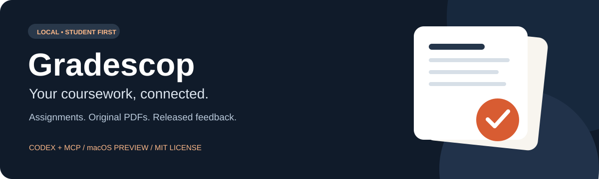
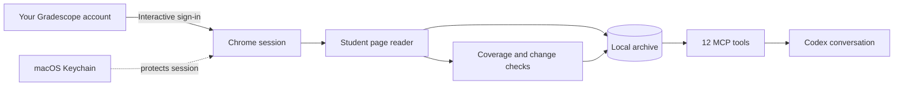

# Gradescop



[](https://github.com/duhaolei43-source/Gradescope/actions/workflows/test.yml) [](LICENSE) [](ROADMAP.md)

[Get started](#quick-start) · [Architecture](#how-it-works) · [Roadmap](ROADMAP.md) · [Test coverage](docs/TESTING.md) · [Contribute](CONTRIBUTING.md)

A local, read-only Gradescope MCP server and Codex plugin for students. Archive assignments, deadlines, original and graded PDFs, released rubric feedback, comments, annotations, and accessible submission history across courses.

**Preview release: macOS only.** Independent project; not affiliated with Gradescope, Turnitin, or OpenAI. Each user signs in to their own account. This repository contains code and synthetic tests, not account data.

## Quick start

Requires macOS, Node.js 22.13 or newer, Google Chrome, and Poppler (`pdftotext` and `pdftoppm` on PATH). Optional OCR requires Tesseract. With Homebrew, install these using `brew install node poppler` and optionally `brew install tesseract`; install Google Chrome separately.

```sh
git clone https://github.com/duhaolei43-source/Gradescope.git gradescope-personal
cd gradescope-personal
npm ci
node scripts/configure.mjs
npm test
npm run connect
npm run sync
```

Sign in yourself in the browser opened by `connect`; institutional SSO/MFA may require interaction. Never place your password in a prompt, repository, command, or environment variable. A blocked SSO flow is unsupported until verified; do not bypass it.

## Connect to Codex

From the cloned directory, register the server with the Codex CLI:

```sh
codex mcp add gradescope --env NODE_NO_WARNINGS=1 --env "PATH=$PATH" -- "$(command -v node)" "$PWD/src/server.mjs"
```

Open a new local Codex task. Ask: “Refresh Gradescope and show upcoming assignments,” or “Read all released feedback on this assignment.” Other STDIO MCP clients can use the generated `.mcp.json` configuration. Keep this checkout in place: configuration points at it.

This command registers MCP tools; it does not install a plugin card in the + picker. For plugin packaging, this repository includes `.codex-plugin/plugin.json`, the generated `.mcp.json`, an icon, and `skills/gradescope/SKILL.md`. Use Codex's plugin-creator workflow to register the clone in your personal marketplace, validate it, and install `gradescope-personal@personal`. A one-command public marketplace installer is planned. Do not install both registrations simultaneously under the same server name.

## What is available

Twelve tools: connection_status, connect, sync, sync_status, list_courses, list_assignments, get_assignment, get_submission, get_feedback, read_document, search_coursework, get_changes.

A full sync includes older courses. It reconciles dashboard counts and reports retrieval failures. Query summaries first, then relevant questions and PDF pages. Original files retain every page. Rubric point_effect accounts for positive and negative scoring. OCR results require verification.

Use `node src/cli.mjs status` for cached health. A saved session is not proof that login still works. Expired sessions require `npm run connect`. Sync is asynchronous through MCP; wait for sync_status before reporting current data.

## Daily updates

Scheduling is opt-in and is not created by installation. Ask Codex: “Run a full Gradescope sync daily at 9 AM local time, including older courses. Notify only on changed assignments, deadlines, submissions, grades or feedback, failures, or required login. Stay quiet when unchanged.” The host and Codex must be available for local scheduled execution. Never use GitHub Actions to synchronize your actual coursework.

## Privacy and limits

The archive is in `~/Library/Application Support/GradescopePersonal`, outside this repository. Sessions use AES-256-GCM with a macOS Keychain key. Files are created with owner-only permissions. PDF/text coursework itself is not encrypted by this application. Protect your OS account and disk. Retrieved text enters your MCP client's conversation when requested. No hosted service receives the archive from this code.

The adapter reads account-visible student pages and embedded viewer data. It never submits work, starts assessments, activates attempts, edits answers, or sends regrade requests. Reads may record a view on Gradescope. Hidden grades, unopened timed content, unavailable templates, and unapproved external file hosts cannot be promised. Layout changes can break extraction. Support is currently limited to www.gradescope.com and observed upload hosts.

See [public plan](ROADMAP.md), [approach comparison](docs/APPROACHES.md), [security guidance](SECURITY.md), and [contributing](CONTRIBUTING.md).

## How it works



| You ask | Gradescop retrieves |
| --- | --- |
| What is due? | Assignment status and timezone-aware deadlines |
| Why did I lose points? | Released rubric items, scoring direction, comments and annotations |
| Show the original work | Preserved PDF files and page-level text |
| What changed? | Changes since the previous sync, with explicit retrieval failures |

## Quality and licensing

Run `npm run smoke` after installing Poppler. Tests use synthetic records and a generated PDF, isolated temporary archives and local MCP processes. No login or private coursework is needed. See [the test matrix and limits](docs/TESTING.md).

Released under the [MIT license](LICENSE). Dependency licenses remain their respective authors' property. Gradescope and Codex names identify compatible products; this project is independent.
